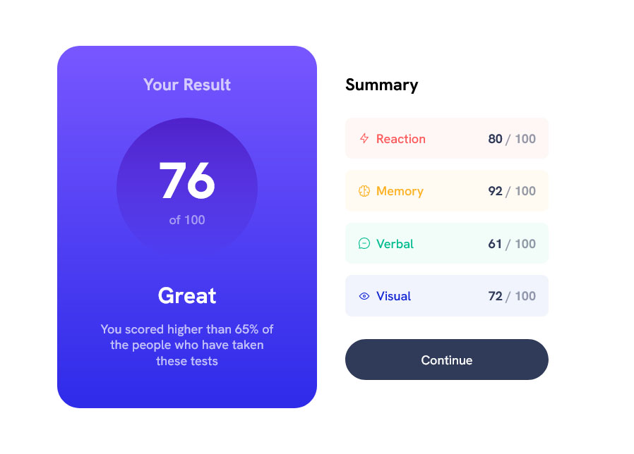

# Frontend Mentor - Results summary component solution

This is a solution to the [Results summary component challenge on Frontend Mentor](https://www.frontendmentor.io/challenges/results-summary-component-CE_K6s0maV). Frontend Mentor challenges help you improve your coding skills by building realistic projects. 

## Table of contents

- [Overview](#overview)
  - [The challenge](#the-challenge)
  - [Screenshot](#screenshot)
  - [Links](#links)
- [My process](#my-process)
  - [Built with](#built-with)
  - [What I learned](#what-i-learned)
  - [Useful resources](#useful-resources)
- [Author](#author)
- [Acknowledgments](#acknowledgments)

**Note: Delete this note and update the table of contents based on what sections you keep.**

## Overview

### The challenge

Users should be able to:

- View the optimal layout for the interface depending on their device's screen size
- See hover and focus states for all interactive elements on the page
- **Bonus**: Use the local JSON data to dynamically populate the content

### Screenshot



### Links

- Solution URL: [](https://github.com/Arkanit7/frontendmentor-results-summary)
- Live Site URL: [](https://arkanit7.github.io/frontendmentor-results-summary)

## My process

### Built with

- Semantic HTML5 markup
- CSS custom properties
- Flexbox
- CSS Grid
- BEM
- Reliability in mind
- SVG sprite

### What I learned

The best part was using custom CSS properties to set certain opacity for an HSL color

```scss
$clr-white-hsl: 0deg 0% 100%;

.component {
  color: #{hsl}($clr-white-hsl / 50%);
}
```

How to properly connect variable fonts:

```scss
// Hanken Grotesk 100-900

@font-face {
  font-family: "Hanken Grotesk";
  src: url("../assets/fonts/hanken-grotesk.ttf") format("truetype-variations");
  font-weight: 100 900;
  font-style: normal;
  font-display: swap;
}
```

### Useful resources

- [IcoMoon](https://icomoon.io/app) - This helped me to create SVG sprite to manipulate icons color.

## Author

- Website - [Portfolio](https://arkanit7.github.io/)
- Frontend Mentor - [@Arkanit7](https://www.frontendmentor.io/profile/Arkanit7)


## Acknowledgments

Big thanks to Kevin Powell for sharing his solution on his YouTube [channel](https://www.youtube.com/@KevinPowell)!
